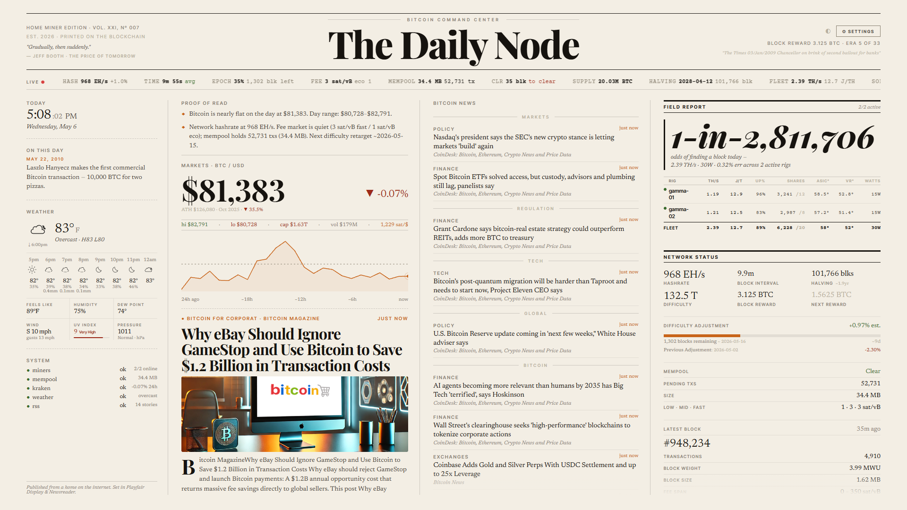
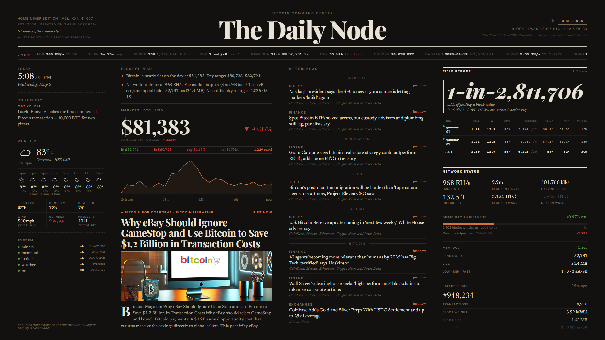

# The Daily Node

> A single-file React dashboard for Bitcoin price, news, weather, and BitAxe mining stats. Designed for a 1920×1080 wall display.

[](LICENSE)
[](https://github.com/GitHubxSuperKai/the-daily-node/releases)
[](https://github.com/GitHubxSuperKai/the-daily-node/commits/main)

**[🔗 Live demo](https://GitHubxSuperKai.github.io/the-daily-node/)** · **[📊 Pitch deck](https://GitHubxSuperKai.github.io/the-daily-node/pitch-deck.html)**




## What it is

A React dashboard that pulls live data from public APIs (Kraken, Mempool.space, CoinGecko, Open-Meteo, RSS feeds) and your local BitAxe miners. The frontend builds to a single `index.html` file with no runtime build step. A small Python proxy ([`bitaxe_api.py`](bitaxe_api.py)) serves both the dashboard and aggregates miner data into one JSON endpoint, so the browser never has to deal with cross-origin requests to your miners.

Built as a personal "field report" for a wall-mounted monitor. The layout is locked to 1920×1080 and scales to fit the browser window.

## Features

- 📈 **BTC price + 24h chart** — Kraken (live) + CoinGecko (history)
- 📰 **Bitcoin news feed** — aggregated from Bitcoin Magazine, CoinDesk, news.bitcoin.com
- ⛓️ **Chain stats** — block height, hashrate, fees, difficulty + adjustment countdown (via Mempool.space)
- ⛏️ **BitAxe fleet monitoring** — live hashrate, power, temps from your local miners
- 🌤️ **Weather widget** — Open-Meteo, with auto dark mode at sunset
- 🌗 **Light + dark themes** — toggle manually or follow sunset
- ⚙️ **In-app settings** — change location, time format, units, API URLs without touching code
- 💾 **No backend** — preferences stored in browser localStorage

## Run it

Pick whichever path matches how you like to run software. All paths produce the same dashboard at `http://<host>:3001/`.

### Option A — Docker (recommended)

```bash
docker run -d \
  -p 3001:3001 \
  -e BITAXE_IPS=<miner-ip-1>,<miner-ip-2> \
  --name daily-node \
  --restart unless-stopped \
  ghcr.io/githubxsuperkai/the-daily-node:latest
```

Or with Compose — copy [`docker-compose.yml`](docker-compose.yml), edit the `BITAXE_IPS` line, then:

```bash
docker compose up -d
```

Multi-arch images are published for `linux/amd64` and `linux/arm64`. Same image runs in any LXC container that has Docker installed.

### Option B — Run from source

```bash
git clone https://github.com/GitHubxSuperKai/the-daily-node.git
cd the-daily-node
npm install && npm run build
BITAXE_IPS=<miner-ip-1>,<miner-ip-2> python3 bitaxe_api.py --bind 0.0.0.0
```

Requires Node 20+ and Python 3.10+. The proxy uses Python's standard library only — no `pip install`.

### Option C — Static dashboard, no miners

If you don't have a BitAxe and just want the dashboard for price / news / chain stats:

```bash
npm install && npm run build
npm run dev   # serves index.html on http://localhost:3000/
```

The Miners card will show a friendly placeholder.

## Configuration

- `BITAXE_IPS` (env var) — comma-separated list of miner IPs. Set this when launching `bitaxe_api.py` or the Docker container.
- All other knobs live in [`src/config.js`](src/config.js): API endpoints, polling intervals, feed list, default location.
- Per-user preferences (location, time format, temp unit, dark mode) are configurable via the in-app settings panel (⚙ icon in the top-right) and persist to browser `localStorage`.

## Architecture

Custom React hooks (`useBTC`, `useChain`, `useBitaxe`, `useWeather`, `useRSS`, `useFeedHealth`) fetch from external APIs and feed the presentational component tree. Build step (`build.js`) concatenates `src/` modules and inlines them in `src/index.html` to produce the single-file `index.html`. Babel transpiles JSX in the browser at runtime.

Full breakdown in [`docs/ARCHITECTURE.md`](docs/ARCHITECTURE.md). Setup and deployment details in [`docs/SETUP.md`](docs/SETUP.md).

## Contributing

This is a personal project. Bug reports and feature requests are welcome via Issues. Pull requests are welcome but not guaranteed to be merged — please open an issue first to discuss. Forks are always welcome.

See [CONTRIBUTING.md](CONTRIBUTING.md) for details.

## License

[MIT](LICENSE) © 2026 SuperKai
